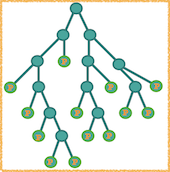

# Probabilistic Random Forest (PRF)

The PRF is a modification the long-established Random Forest (RF) algorithm that takes into account uncertainties in the measurements (i.e., features) as well as in the assigned classes (i.e., labels). To do so, the Probabilistic Random Forest (PRF) algorithm treats the features and labels as probability distribution functions, rather than deterministic quantities. The details of the algorithm along with comparison to the original RF are described in the paper:

[Probabilistic Random Forest: A machine learning algorithm for noisy datasets](https://arxiv.org/abs/1811.05994v1)


## installation:

clone the repository and from PRF\ run
```
python setup.py install
```

Tested only on python 3, please email ```itamareis@gmail.com``` if you encounter any issues with installation or running the code.


## example usage   
```
from PRF import prf
prf_cls = prf(n_estimators=10, bootstrap=True, keep_proba=0.05, n_jobs=2)
prf_cls.fit(X=X_train, dX=dX_train, y=y_train)
pred = prf_cls.predict(X=X_test, dX=dX_test)
```

also see PRF/examples folder:

https://nbviewer.jupyter.org/github/ireis/PRF/blob/master/PRF/examples/PRF_for_missing_data.ipynb

## uncertainties in labels
To use the PRF with uncertainties in labels, use the input variable py instead of y.
py is intended to have the probability of an item to have each of the possible labels.
That is, py is an array of size (number of objects x number of labels).
For example, if you have 70% confidence in having label 1 for one item, and you have 2 possible labels, py for this item is (0.7, 0.3).
For a second item, having 65% confidence to have the other label, py would be (0.35,0.65).

## Authors

* **Itamar Reis** - https://github.com/ireis

* **Dalya Baron** - https://github.com/dalya

## License

This project is licensed under the MIT License - see the [LICENSE.md](LICENSE.md) file for details
